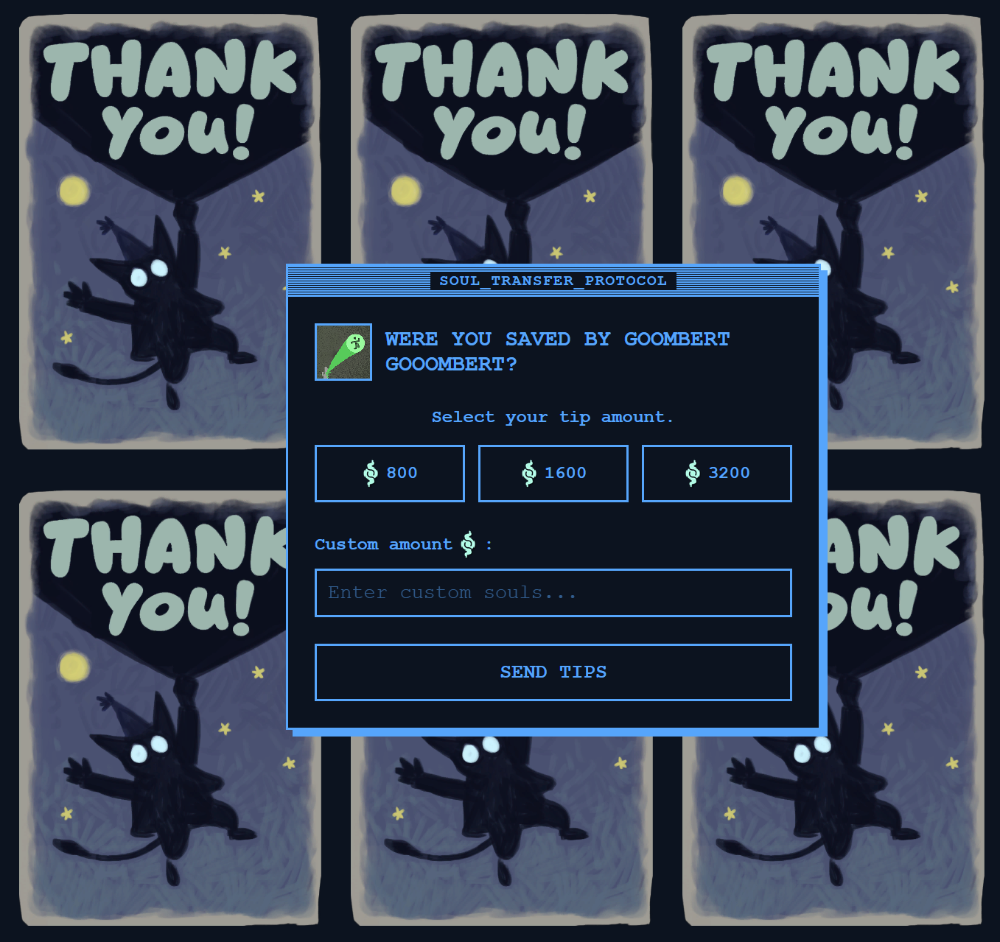

I work in progress joke that went too far

A companion gist to change a theme:
[github gist](https://gist.github.com/vvseva/5f66e5edba811f8fb53ca12d5a4cd79a)

Available for some time at [supportyoursupport.eu](https://supportyoursupport.eu)

Tips are not mandatory but appreciated.

- The site runs on GitHub Pages. It functions as a static page but uses a few workarounds to handle global state and data collection
- The active character theme (viscous, rem, or dynamo) is controlled remotely. The script fetches a raw JSON file from a GitHub Gist on load. Editing the gist instantly updates the color palette, gifs, and background image for all.
- A free Firebase Realtime Database logs the tip submissions
- Chart.js queries the latest 100 tips from Firebase, aggregates the data into a histogram and shows it.
